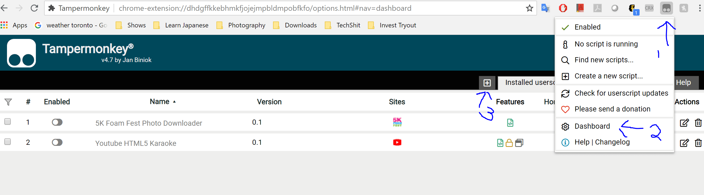

# Youtube Karaoke
Attenuate vocal on youtube MVs

# How it looks on your Youtube Player

# SETUP
* Download TamperMonkey for [Chrome](https://chrome.google.com/webstore/detail/tampermonkey/dhdgffkkebhmkfjojejmpbldmpobfkfo?hl=en) or your default browser
* Open dashboard and add a new script
    * 
* Copy https://raw.githubusercontent.com/heyqule/youtubekaraoke/master/karaoke.js to your new script, save it and enable it
* Find a mv on youtube and test it out
   * If you don't see the mic icon, try fresh the tab.
* Accept microphone permission notification
    * There is a noticeable delay when connecting the mic via browser.
    * The ideal way is to connect the mic with a zero latency audio interface    
* ???
* Profit

#Features
- Support center cut
- Support left or right cut from 90s KTV videos
    - https://www.youtube.com/watch?v=Hm1cQlvBTz0  (set to right channel attenuation) (盧巧音 - 好心分手) 
- Support mic gain if mic is connect via browser    
- Support per song setting save as localstorage
    
#Experimental Features (requires API key)
------------
* Save setting to Cloud
* Automatically load your setting from Cloud
* Search other tracks from Cloud, instead of youtube
 
#Limitations
Not all songs are compatible with this plugin.

Orignally MVs usually work the best 
 https://youtu.be/LWV-f6dMN3Q?t=60 (林俊傑 JJ Lin - 修煉愛情 Practice Love)
 https://www.youtube.com/watch?v=ZSM3w1v-A_Y (Timbaland - Apologize ft. OneRepublic)

Too many details lost with rock/metal  / 
 
https://www.youtube.com/watch?v=eVTXPUF4Oz4 (Linkin Park - In the end)
https://www.youtube.com/watch?v=5NPBIwQyPWE (Avril Lavigne - Complicated)

Snare sounds funny.. in fact, many parts sound funny lol.
https://www.youtube.com/watch?v=YVkUvmDQ3HY (Eminem - Without Me)
https://www.youtube.com/watch?v=VYOjWnS4cMY (Childish Gambino - This Is America)

It's not able to cut certain part of the vocal due to the way it mixed.
  https://www.youtube.com/watch?v=zhGnuWwpNxI (Japanglish Song!【Tokyo Bon東京盆踊り2020】Namewee 黃明志 Ft. Meu Ninomiya)
  https://www.youtube.com/watch?v=5anLPw0Efmo (Evanescence - My Immortal)

The result from concerts MVs are usually not as good.
  https://www.youtube.com/watch?v=rZKQmjTtVK8 (Hins Cheung - 張敬軒 -《櫻花樹下》(Live))
  https://www.youtube.com/watch?v=Ri7-vnrJD3k (Adele - Set Fire To The Rain (Live at The Royal Albert Hall))

# Credits
Center attenuation functions made by Richard Stanton 
  https://github.com/stanton119/YouTube-Karaoke

